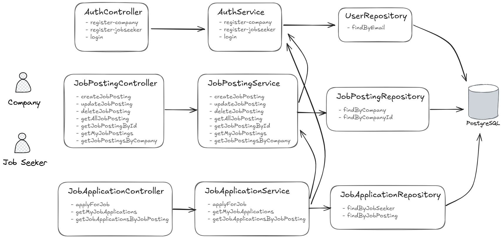
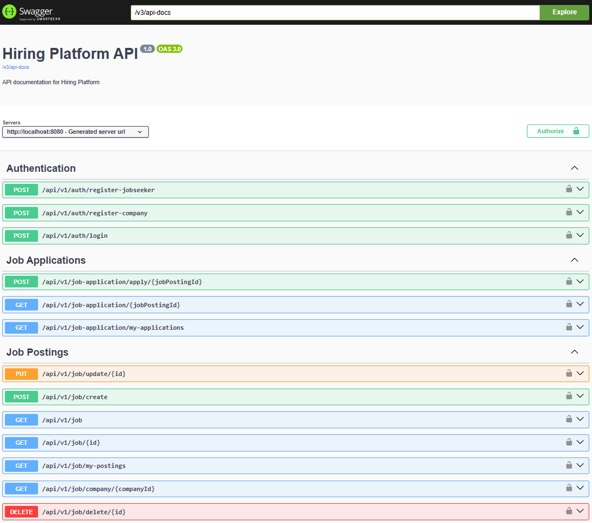

# Hiring Platform API



## 📋 Overview

Hiring Platform API is a comprehensive backend solution designed to facilitate the hiring process between companies and job seekers. Built with Spring Boot, this RESTful API provides a secure and efficient platform for job posting, application management, and user authentication.

## 🚀 Features

- **User Authentication & Authorization**
  - Secure JWT-based authentication
  - Role-based access control (Company, Job Seeker)

- **Company Features**
  - Company profile registration.
  - Job posting creation, updating, and deletion.
  - Viewing applications submitted for their job postings.

- **Job Seeker Features**
  - Job seeker profile registration.
  - Submitting job applications with an optional cover letter.
  - Viewing their own submitted applications.

- **Job Posting Management**
  - Publicly accessible listing of all job postings.
  - Retrieval of job postings by ID or by company.

## 🛠️ Technologies

- **Java 21**
- **Spring Boot 3.3.10**
- **Spring Security** with JWT authentication
- **Spring Data JPA**
- **PostgreSQL** database
- **Lombok** for reducing boilerplate code
- **Maven** for dependency management
- **spring-dotenv** for environment variable management
- **SpringDoc OpenAPI (Swagger UI)** for API documentation

## 📦 Project Structure

```
src/main/java/com/yusufsahin/hiring_platform_api/
├── config/               # Application configuration
├── controller/           # REST API endpoints
├── dto/                  # Data Transfer Objects
├── exception/            # Custom exceptions
├── model/                # Entity models
├── repository/           # Data access layer
├── security/             # Security configuration
└── service/              # Business logic
```

## 🔧 Setup & Installation

You can run the project in two ways: **Manual (Maven)** or **Docker**. Choose the method that fits your environment.

---

### ▶️ Manual Setup (Maven)

#### Prerequisites
- Java 21 or higher installed
- Maven installed
- PostgreSQL server running

#### Steps
1. **Clone the Repository**
    ```bash
    git clone https://github.com/Yusufsahin1/HiringPlatformApi.git
    cd HiringPlatformApi
    ```
2. **Configure Environment Variables**
    Create a `.env` file in the project root with:
    ```env
    DB_URL=jdbc:postgresql://localhost:5432/postgres
    DB_SCHEMA=hiring_platform
    DB_USERNAME=your_db_username
    DB_PASSWORD=your_db_password
    SECRET_KEY=your_jwt_secret_key
    ```
   
3. **Build and Run**
    ```bash
    mvn clean install
    mvn spring-boot:run
    ```

---

### ▶️ Docker Setup

#### Prerequisites
- Docker (and optionally Docker Compose) installed

#### Steps
1. **Clone the Repository**
    ```bash
    git clone https://github.com/Yusufsahin1/HiringPlatformApi.git
    cd HiringPlatformApi
    ```
2. **Configure Environment Variables**

    Create a `.env` file in the project root as above.


3. **Build and Run with Docker**
    ```bash
    docker build -t hiring-platform-api .
    docker run -p 8080:8080 --env-file .env hiring-platform-api
    ```
   **Or with Docker Compose:**
    ```bash
    docker-compose up -d
    docker-compose down # To stop
    ```

---

### API and Documentation
- API endpoints are available under `/api/v1/` (e.g. `http://localhost:8080/api/v1/job`)
- Access the API documentation at `http://localhost:8080/swagger-ui/index.html`

After setup, you can test the API endpoints using the example above or explore all endpoints via Swagger UI.

## 🔌 API Documentation & Endpoints

The API documentation is automatically generated using Swagger UI and available at:
`http://localhost:8080/swagger-ui/index.html`

You can explore and test all endpoints interactively through this interface.



### Authentication

- `POST /api/v1/auth/register-company` - Register a new user (company role)
- `POST /api/v1/auth/register-jobseeker` - Register a new user (job seeker role)
- `POST /api/v1/auth/login` - Authenticate and receive JWT token

### Job Postings

- `GET /api/v1/job` - Get all job postings
- `GET /api/v1/job/{id}` - Get job posting by ID
- `POST /api/v1/job/create` - Create a new job posting (Company role)
- `PUT /api/v1/job/update/{id}` - Update a job posting (Company role)
- `DELETE /api/v1/job/delete/{id}` - Delete a job posting (Company role)
- `GET /api/v1/job/my-postings` - Get job postings created by the authenticated company
- `GET /api/v1/job/company/{companyId}` - Get job postings by company ID

### Job Applications

- `POST /api/v1/application/apply` - Submit a job application (Job Seeker role)
- `GET /api/v1/application/my-applications` - Get applications submitted by the authenticated job seeker
- `GET /api/v1/application/job/{jobId}` - Get applications for a specific job posting (Company role)

## 🔒 Security

The API uses JWT (JSON Web Token) for authentication. To access protected endpoints:

1. Obtain a JWT token by authenticating via the login endpoint
2. Include the token in the Authorization header of subsequent requests:
   ```
   Authorization: Bearer your_jwt_token
   ```

## 📄 License

This project is licensed under the MIT License. See the [LICENSE](LICENSE) file for details.